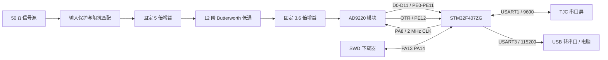
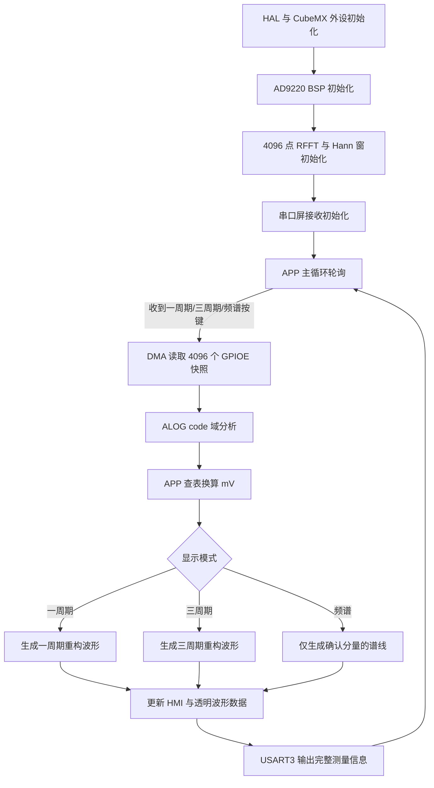
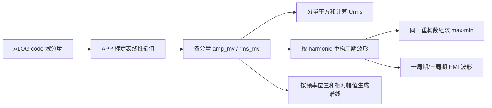

# TI_CQUPT_2026G 周期信号测量分析装置

本仓库面向 STM32F407ZGTx 的周期信号测量分析装置。当前软件基线采用 2 MSPS、4096 点采样与 CMSIS-DSP 实数 FFT，完成时域统计、频率与谐波识别、幅值换算、波形/频谱显示以及电脑串口调试输出。

本文档以当前仓库源码、CubeMX 生成代码和 Keil 工程配置为准。建议硬件拓扑中的增益值是模拟前端设计值，不作为 ALOG 算法中的固定换算常数。

## 1. 主控与引脚对应表

### 1.1 AD9220 并行采集接口

AD9220 的 12 位数据总线连续连接到 GPIOE 低 12 位。采集时 DMA 直接读取 `GPIOE->IDR`，ALOG 再使用 `0x0FFF` 提取有效码值，因此 D0～D11 的顺序不能交换。

| AD9220/功能 | STM32F407ZG 引脚 | MCU 功能 | 方向 | 当前用途与注意事项 |
|---|---|---|---|---|
| D0 | PE0 | GPIOE bit 0 | AD9220 → MCU | ADC 数据最低位 |
| D1 | PE1 | GPIOE bit 1 | AD9220 → MCU | ADC 数据位 1 |
| D2 | PE2 | GPIOE bit 2 | AD9220 → MCU | ADC 数据位 2 |
| D3 | PE3 | GPIOE bit 3 | AD9220 → MCU | ADC 数据位 3 |
| D4 | PE4 | GPIOE bit 4 | AD9220 → MCU | ADC 数据位 4 |
| D5 | PE5 | GPIOE bit 5 | AD9220 → MCU | ADC 数据位 5 |
| D6 | PE6 | GPIOE bit 6 | AD9220 → MCU | ADC 数据位 6 |
| D7 | PE7 | GPIOE bit 7 | AD9220 → MCU | ADC 数据位 7 |
| D8 | PE8 | GPIOE bit 8 | AD9220 → MCU | ADC 数据位 8 |
| D9 | PE9 | GPIOE bit 9 | AD9220 → MCU | ADC 数据位 9 |
| D10 | PE10 | GPIOE bit 10 | AD9220 → MCU | ADC 数据位 10 |
| D11 | PE11 | GPIOE bit 11 | AD9220 → MCU | ADC 数据最高位 |
| OTR | PE12 | GPIO 输入 | AD9220 → MCU | 过量程指示；BSP 提供读取接口，当前 APP 测量流程未参与判定 |
| CLK | PA8 | TIM1_CH1 / AF1 | MCU → AD9220 | 2 MHz 采样时钟，约 50% 占空比 |
| DMA 采样时刻 | PE13 | TIM1_CH3 / AF1 | MCU 内部定时 | CH3 比较事件触发 DMA；通常不需要连接 AD9220 |
| 数字地 | GND | GND | — | 必须与 MCU、模拟前端共地 |

GPIOE PE0～PE12 配置为无上下拉输入。TIM1_CH3 的比较点位于一个采样周期较后位置，用于避开 AD9220 时钟边沿后数据尚未稳定的区间。

### 1.2 串口屏、电脑调试串口与辅助引脚

| 外设/信号 | STM32F407ZG 引脚 | 配置 | 连接对象 | 当前用途 |
|---|---|---|---|---|
| HMI_TX | PA9 / USART1_TX | 9600, 8N1 | 串口屏 RX | 发送文本、波形和频谱命令 |
| HMI_RX | PA10 / USART1_RX | 9600, 8N1 | 串口屏 TX | 接收按键及透明传输应答 |
| DEBUG_TX | PB10 / USART3_TX | 115200, 8N1 | USB 转串口 RX | `Debug_printf` 测量与调试输出 |
| DEBUG_RX | PB11 / USART3_RX | 115200, 8N1 | USB 转串口 TX | 已初始化，当前主要调试流程不依赖接收 |
| 调试/活动指示 | PC13 | 推挽输出 | 板载或外接 LED | HMI 按键事件时翻转 |
| DAC_OUT1 | PA4 | DAC Channel 1 | 预留 | CubeMX 保留初始化；固定增益方案不启动 DAC、不控制 AD603 |
| SWDIO | PA13 | SWD | 调试器 | 下载与在线调试 |
| SWCLK | PA14 | SWD | 调试器 | 下载与在线调试 |
| HSE_IN | PH0 | OSC_IN | 8 MHz 晶振 | 系统外部时钟输入 |
| HSE_OUT | PH1 | OSC_OUT | 8 MHz 晶振 | 系统外部时钟输出 |

串口接线必须交叉连接 TX/RX，并将串口屏、USB 转串口、STM32 与模拟前端连接到公共参考地。串口屏为 5 V 供电时，应确认其 TX 输出电平与 STM32 3.3 V IO 兼容。

## 2. STM32 SYS 与外设配置

### 2.1 MCU 与系统时钟

| 项目 | 当前配置 | 计算结果/说明 |
|---|---|---|
| MCU | STM32F407ZGTx，LQFP144 | Cortex-M4F |
| 时钟源 | HSE 8 MHz | 外部晶振 |
| PLL | PLLM=8, PLLN=336, PLLP=2, PLLQ=4 | PLL VCO 输入 1 MHz，VCO 336 MHz |
| SYSCLK | PLLCLK | 168 MHz |
| AHB | SYSCLK / 1 | HCLK 168 MHz |
| APB1 | HCLK / 4 | PCLK1 42 MHz，APB1 定时器 84 MHz |
| APB2 | HCLK / 2 | PCLK2 84 MHz，APB2 定时器 168 MHz |
| Flash 等待周期 | FLASH_LATENCY_5 | 适配 168 MHz |
| 电压范围 | PWR_REGULATOR_VOLTAGE_SCALE1 | 高性能运行范围 |
| 调试接口 | Serial Wire | PA13/PA14 |
| HAL 时基 | SysTick | HAL 默认 1 ms 系统节拍 |
| RTOS | 未使用 | 主循环轮询执行 |

当前 PLLQ 输出为 84 MHz，工程没有使用 USB/SDIO/RNG 的 48 MHz 时钟域；若以后启用这些外设，必须重新核对时钟树，不能直接沿用当前 PLLQ 配置。

### 2.2 TIM1 与 AD9220 采样时序

| 项目 | 当前配置 |
|---|---|
| TIM1 输入时钟 | 168 MHz |
| Prescaler | 0 |
| Counter Period | 83，即计数 0～83 |
| CH1 PWM Compare | 42 |
| CH1 输出频率 | 168 MHz / 84 = 2 MHz |
| CH1 作用 | PA8 输出 AD9220 采样时钟 |
| CH3 Compare | 63 |
| CH3 作用 | 在采样周期后段产生 DMA 请求 |
| 固定采样点数 | 4096 |
| 单次采样窗口 | 4096 / 2 MHz = 2.048 ms |

### 2.3 DMA 配置

| 项目 | 当前配置 |
|---|---|
| DMA 请求源 | TIM1_CH3 |
| 控制器/数据流/通道 | DMA2 Stream6 Channel6 |
| 传输方向 | Peripheral to Memory |
| 外设地址 | `GPIOE->IDR` |
| 外设地址递增 | 关闭 |
| 内存地址递增 | 开启 |
| 外设/内存数据宽度 | Word / Word |
| 模式 | Normal |
| 优先级 | Very High |
| FIFO | 关闭 |
| 当前完成方式 | BSP 启动 TIM1 后轮询 DMA 完成，超时退出 |

DMA 缓冲区元素为 `uint32_t`，但有效 ADC 数据仅为低 12 位。不要将 DMA 宽度改成 Half Word 后仍沿用当前 `GPIOE->IDR` 与缓冲区处理逻辑，除非同时完成并验证整条采集链修改。

### 2.4 UART、GPIO 与 DAC

| 外设 | 当前配置 | 软件使用情况 |
|---|---|---|
| USART1 | 9600 baud，8 数据位，1 停止位，无校验，无流控 | 串口屏；当前按字节中断接收，阻塞发送命令 |
| USART1_RX DMA | DMA2 Stream2 Channel4，Byte，Normal，Low | CubeMX 已生成，当前 APP 未采用该 DMA 接收路径 |
| USART3 | 115200 baud，8 数据位，1 停止位，无校验，无流控 | 电脑调试串口，供 `Debug_printf` 使用 |
| GPIOE[12:0] | Input，No Pull | AD9220 D0～D11 与 OTR |
| PC13 | Output Push-Pull，初始高电平 | 调试/活动指示 |
| DAC1_CH1 | 无触发，输出缓冲开启 | 仅保留 CubeMX 初始化；固定增益方案中未启动 |

### 2.5 Keil/CMSIS 配置要点

- 工程宏包含 `USE_HAL_DRIVER`、`STM32F407xx`、`ARM_MATH_CM4`。
- ALOG 使用 CMSIS-DSP `arm_rfft_fast_f32`、`arm_sin_f32` 等单精度函数。
- 工程面向 ARMCC5/C99，所有大数组均放在文件内静态存储区，避免占用任务栈。
- 当前无 FreeRTOS、无动态内存、无复杂后台调度；`while (1)` 中调用 APP 轮询入口。

## 3. 建议硬件拓扑

### 3.1 信号与数字控制链路



模拟链名义总增益约为 5 × 3.6 = 18。该数值、AD9220 实际满量程、滤波器幅频响应与信号源 50 Ω 条件都需要实测标定；ALOG 只输出 ADC code 域结果，mV 换算由 APP 标定表完成。

### 3.2 供电、接地和布线建议

- 模拟前端与 AD9220 使用低噪声、充分去耦的电源；串口屏的脉冲负载不要直接污染模拟电源。
- 模拟地、ADC 数字地和 MCU 地保持完整回流路径，在电源入口或规划的单点处连接，避免串口屏电流经过模拟输入回路。
- PA8 时钟线、PE0～PE11 并行数据线尽量短，保持连续地参考；时钟线远离模拟输入和高阻节点。
- AD9220 模块每个电源脚附近放置合适的高频去耦，模拟前端各级也应就近去耦。
- 输入保护与终端阻抗需要结合信号源 50 Ω 输出方式确认，避免“开路幅度”和“50 Ω 负载幅度”混淆。
- 在 PCB 或飞线调试阶段预留 AD9220 CLK、OTR、模拟输入与关键放大级输出测试点，便于示波器同时验证采样时序和模拟幅度。
- 当前固定增益方案不需要 PA4 DAC 与 AD603 控制连接；遗留驱动文件不代表现行硬件必须安装 AD603。

## 4. 软件与算法结构

### 4.1 目录职责

```text
Core/
├─ Src/main.c                 系统初始化与主循环入口
├─ Src/stm32f4xx_hal_msp.c    时钟、GPIO 复用和 DMA 底层配置
└─ Src/*                      CubeMX 生成的 GPIO/TIM/DMA/UART/DAC 代码

User/
├─ bsp/
│  ├─ bsp_ad9220.c/.h         TIM1 时钟、GPIOE 并行口和 DMA 采集
│  └─ bsp_ad603.c/.h          遗留 DAC 增益接口，固定增益路径未使用
├─ alog/
│  └─ alog_signal.c/.h        code 域统计、FFT、峰值与谐波分析
├─ app/
│  └─ app_process.c/.h        测量流程、mV 标定、重构及显示数据组织
├─ tjc_usart_hmi/
│  └─ tjc_usart_hmi.c/.h      HMI 命令发送、调试串口封装
└─ debug/
   └─ debug.c/.h              调试支持
```

### 4.2 模块边界

| 模块 | 输入 | 输出 | 不负责的内容 |
|---|---|---|---|
| BSP | APP 的采集请求 | 4096 个 GPIOE 快照 | FFT、标定、显示 |
| ALOG | `uint32_t raw[4096]` | code 域时域统计、频率、幅值、相位、谐波关系 | ADC 主动采集、mV 换算、HMI |
| APP | BSP 数据与 ALOG 结果 | mV 结果、重构波形、频谱显示数据、调试文本 | 修改 ADC/FFT 底层实现 |
| HMI/串口封装 | APP 的文本和字节流 | USART1 屏幕命令、USART3 调试输出 | 测量算法与调度决策 |

### 4.3 主测量流程



该流程是一次按键触发一次完整测量，没有引入 RTOS 或复杂状态机。4096 点采集本身约 2.048 ms，屏幕通信和计算时间共同构成最终显示的测量耗时。

### 4.4 ALOG 核心算法

固定参数：

| 参数 | 当前值 |
|---|---|
| 采样率 | 2,000,000 Hz |
| FFT 点数 | 4096 |
| FFT 频点间隔 | 2,000,000 / 4096 = 488.28125 Hz |
| 有效搜索范围 | 10 kHz～500 kHz |
| 最大输出分量数 | 3 |
| ADC 有效位 | GPIOE 快照低 12 位 |


主要处理说明：

- 时域统计在加窗前完成，保留 `dc_code`、`min_code`、`max_code`、`raw_pp_code` 和 `time_rms_code`。
- FFT 使用 Hann 窗降低非整数频点泄漏，实数 FFT 压缩输出被转换为正频率单边幅度谱。
- 峰值搜索只在 10～500 kHz 范围内进行，使用三点插值提高频率估计稳定性。
- 候选峰经过整数谐波关系筛选，最多保留 3 个有效分量。
- ALOG 的幅值、RMS、噪声和重构结果都保持 ADC code 单位，不包含固定 18 倍、滤波器或 mV 补偿。

### 4.5 APP 标定、波形与频谱



当前 `test-zero-phase` 实验路径忽略 FFT 的相对相位，按照 `Σ Ai·sin(hi·ωt)` 用各分量的谐波阶次和标定后峰值重构波形：

- HMI 时域波形与显示 Upp 来自同一重构数组，避免两套数据来源不一致。
- Urms 仍由各频率分量 RMS 的平方和计算，不受零相位重构影响。
- 原 FFT 相位字段和旧相位重构路径仍保留，便于后续对比验证。
- 频谱只绘制已经确认的基波/谐波，横向按 0～500 kHz 从左到右定位，谱线高度体现相对幅值。
- HMI 频率文本按 0.5 kHz 分辨率显示；内部计算仍保留浮点精度。

### 4.6 当前测试与硬件标定边界

软件可以在没有进一步模拟补偿的情况下验证以下项目：

- AD9220 2 MSPS、4096 点采集是否连续且码序正确。
- DC、时域极值、原始峰峰值、时域 RMS 和噪声统计。
- 10～500 kHz 内基波频率、谐波次数和最多 3 个主要分量识别。
- HMI 一周期、三周期及定性频谱的方向、位置和相对高度。
- USART3 每次测量的完整调试输出。

硬件到位后仍需通过标准信号源与示波器补充或复核：

- ADC code 到输入端 mV 的分频点、多幅值标定及线性度。
- 固定 5 倍、12 阶低通、固定 3.6 倍链路的实际幅频响应。
- 50 Ω 源/负载条件、AD9220 满量程与直流偏置的实测关系。
- 10 kHz 和 500 kHz 搜索边界、500 kHz 每周期仅约 4 点时的峰峰值误差。
- 谐波叠加时零相位重构是否符合题目信号源设定；若输入具有任意相位，需要切回并验证相对相位重构路径。
- OTR 过量程、模拟削顶、时钟与数据建立保持时间以及不同板卡间一致性。

## 5. 上电与联调顺序

1. 不接模拟输入，确认 3.3 V、5 V 和各模拟电源正常且公共地可靠。
2. 示波器检查 PA8，应为约 2 MHz、约 50% 占空比的时钟。
3. 连接 AD9220 后检查 PE0～PE11 无固定短路或位序错误，观察 OTR 是否异常。
4. 连接电脑调试串口：PB10 接 USB-UART RX，PB11 接 USB-UART TX，115200 8N1。
5. 连接串口屏：PA9 接屏 RX，PA10 接屏 TX，9600 8N1。
6. 从低幅、低频正弦信号开始，依次核对串口 code 值、FFT 频率、标定 mV 和 HMI 显示。
7. 再进行 10～500 kHz 扫频、不同幅值和多谐波组合测试，记录标定误差与边界表现。

## 6. 重要约束

- 当前采样方案固定为 2 MSPS、4096 点；算法接口不接受可变 FFT 长度。
- 不在 ALOG 中读取 GPIO、启动 DMA、访问 HMI 或调用 AD603。
- 不在 ALOG 中写死 18 倍增益、AD9220 满量程、滤波器补偿或 mV 换算。
- 固定增益硬件路径中不启用 AD603 自动增益，PA4 DAC 仅为遗留预留。
- 修改 CubeMX 时应保留 PE0～PE11 连续位映射、TIM1_CH1 采样时钟和 TIM1_CH3 DMA 触发关系。
- 任何补偿表或重构策略都应先由实测数据证明，再以可关闭、可对照的最小改动加入。
